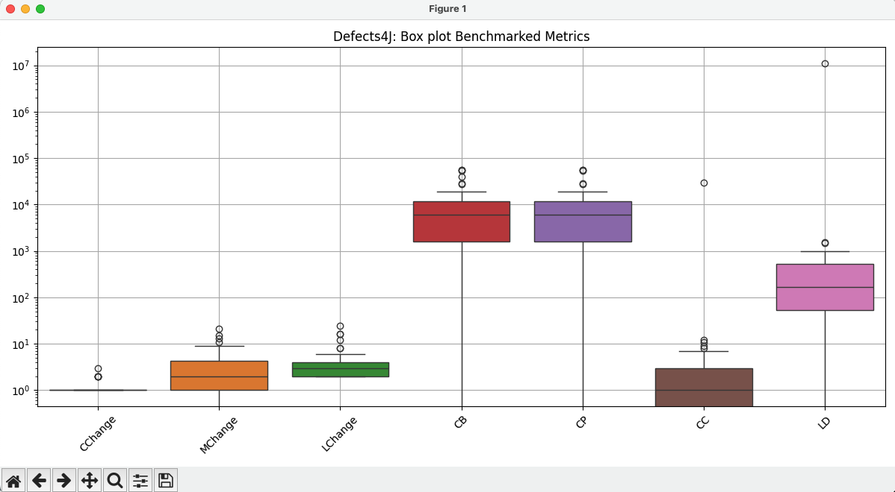

# Defects4J

## How to Generate and Run Tests? (Milestone 3)


**Install defects4j framework**
```
git clone https://github.com/rjust/defects4j
cd defects4j
cpanm --installdeps .
./init.sh
export PATH=$PATH:"yourpath2defects4j"/framework/bin
```
**Command to create tests:**
```
gen_tests.pl -g [randoop/evosuite] -p {project_name} -v {bug_id}b -n 1 -o /path/to/milestone3/location -b 250 [-E]
```

**Command to use to run tests:**

```
cd <projectname_id>/buggy/
defects4j test
```

**Progress made for this milestone for Defects4J:**

- Created tests for 24 bugs with about 5+ mins of budget for Randoop Regression tests. The rest could not be generated even with 10+ min budget.
- Created tests for 59 bugs using Randoop for Randoop Regression tests. 
- Created tests for 68 bugs using Evosuite Regression tests with about 3+ min budgets.
- Working on Coverage and Visualization.

## Background for (Milestone 2)


**Challenges:**

- Tests for Chart could not be obtained due to SVN errors on MacOS system.
- Have not been able to fix the SVN-SQLite environment version bug - the machine does not seem to use the right version even when there are multiple versions installed and the right one is exported to the $PATH environment.
- Will be experimenting and look for a fix for next milestone.
- Computing CodeBLUE the naive way using a list of file names yields incorrect results (0.5 for all bugs) but using an alternative-approach of concatenating file content and computing it yields the correct result in the range of ~0.999. However this has been ignored in the results due to high overhead and taking lots of hours in my local machine.


**Location of deliverables:**

- *Source Code* of all scripts for THIS specific bug dataset can be found parallel to this readme file under the `scripts` subdirectory. 

**Discussion of Results:**

The box plot obtained can be viewed here. 

Observations:

1. Classes changes are usually between 0-10, Methods between 0-30  nd lines changed up to 0-50. Which also intrusively make sense.
2. The cyclomentric complexity benchmarks are similar for buggy and patched versions because the code changes are relatively small. But there is a clear difference in the outliers because they are more probable to have faults.

## Dataset Description (Milestone 1)

### Background

Defects4J is a collection of reproducible bugs and a supporting infrastructure (defects4j framework) with the goal of advancing software engineering research. It is a collection of real-world bugs from open-source Java projects that contains buggy and fixed versions of source code. The creators collected it by 1. choosing sufficiently sized and popular open source projects 2. bug identification 3. bug isolation and repair 4. verification of reproducibility and 5. packaging it with the framework. 

The dataset contains 17 projects. It contains a folder called framework/projects which contains important meta information like the number of active bugs and their SHAs, the relevant test class names, the patch files of src code and test code for each bug.

The source code for the bugs - buggy version + fixed version can be obtained through the defects4j framework commands

```
defects4j checkout -p <project_name> -v <bug_id>[b/f] -w /path/to/working/dir
```

A python script called `get_bug_repos.py` pulls the bug repositories. Another script `get_modified_bug_files.py` gets the actual files with the bug (for each bug in each project). It does this by getting this information (i.e which files have bug fixes) from the dataset's framework directory (i.e `defects4j/framework/projects/<project_name>/modified_classes`). These classes (buggy/fixed versions) are then found in the bug repositories obtained from the previous script and copied to our bugs github repository.

Another `get_patch_file.py` script gets the patch files from `defects4j/framework/projects/<project_name>/patches` - for each bug in each project. Finally, `get_number_of_tests.py` gets the number of tests per bug per project in the dataset by looking into `defects4j/framework/projects/<project_name>/relevant_tests` - counting the tests inside each file (there is 1 file listing the tests for each bug). 

The tests_per_bug data is visualized with `visualize_tests.py`

(All scripts written to collect bugs etc. are located in the ./Scripts directory)

### Note (on challenges faced):

- We have ignored the bugs in Collections project because the bugs are deprecated. 
- The bugs from Chart project were also not obtained due to an error getting the code through the defects4j framework with SVN and SQLite incompatibility on local machines.
- All other bugs were obtained.


### Number of bugs

All the bugs are in Java. The total number of bugs are 835 Bugs (+29 deprecated and non-reproducible).

The breakdown in terms of projects.
| Project Name      | Active Bugs | | Project Name      | Active Bugs |
|-----------------|-------------|-|-----------------|-------------|
| Chart           | 26          | | Jsoup           | 93          |
| Cli             | 39          | | JxPath          | 22          |
| Closure         | 174         | | Lang            | 64          |
| Codec           | 18          | | Math            | 106         |
| Collections     | 4           | | Mockito         | 38          |
| Compress        | 47          | | Time            | 26          |
| Csv             | 16          | | Gson            | 18          |
| JacksonCore     | 26          | | JacksonDatabind | 112         |
| JacksonXml      | 6           | |


### Number of Tests

The number of tests for each bug can be found inside `defects4j/framework/projects/<project_name>/relevant_tests` - each bug has a file that has the names of the tests for the bugs. The `get_number_of_tests.py` script obtains the number for each.

This data exists in a json file called `tests_per_bug.json` and is visualized below.


### 5 Bug Samples

##### Codec_2
```diff
diff --git a/src/java/org/apache/commons/codec/binary/Base64.java b/src/java/org/apache/commons/codec/binary/Base64.java
index dc2ecfc1..c00fbe5e 100644
--- a/src/java/org/apache/commons/codec/binary/Base64.java
+++ b/src/java/org/apache/commons/codec/binary/Base64.java
@@ -443,7 +443,7 @@ public class Base64 implements BinaryEncoder, BinaryDecoder {
                     }
                     break;
             }
-            if (lineLength > 0 && pos > 0) {
+            if (lineLength > 0) {
                 System.arraycopy(lineSeparator, 0, buf, pos, lineSeparator.length);
                 pos += lineSeparator.length;
             }

```

#### Gson_7

``` diff
diff --git a/gson/src/main/java/com/google/gson/stream/JsonReader.java b/gson/src/main/java/com/google/gson/stream/JsonReader.java
index 7a5e9cbb..d375ba15 100644
--- a/gson/src/main/java/com/google/gson/stream/JsonReader.java
+++ b/gson/src/main/java/com/google/gson/stream/JsonReader.java
@@ -951,12 +951,8 @@ public class JsonReader implements Closeable {
     if (p == PEEKED_NUMBER) {
       peekedString = new String(buffer, pos, peekedNumberLength);
       pos += peekedNumberLength;
-    } else if (p == PEEKED_SINGLE_QUOTED || p == PEEKED_DOUBLE_QUOTED || p == PEEKED_UNQUOTED) {
-      if (p == PEEKED_UNQUOTED) {
-        peekedString = nextUnquotedValue();
-      } else {
+    } else if (p == PEEKED_SINGLE_QUOTED || p == PEEKED_DOUBLE_QUOTED) {
         peekedString = nextQuotedValue(p == PEEKED_SINGLE_QUOTED ? '\'' : '"');
-      }
       try {
         long result = Long.parseLong(peekedString);
         peeked = PEEKED_NONE;
@@ -1183,12 +1179,8 @@ public class JsonReader implements Closeable {
     if (p == PEEKED_NUMBER) {
       peekedString = new String(buffer, pos, peekedNumberLength);
       pos += peekedNumberLength;
-    } else if (p == PEEKED_SINGLE_QUOTED || p == PEEKED_DOUBLE_QUOTED || p == PEEKED_UNQUOTED) {
-      if (p == PEEKED_UNQUOTED) {
-        peekedString = nextUnquotedValue();
-      } else {
+    } else if (p == PEEKED_SINGLE_QUOTED || p == PEEKED_DOUBLE_QUOTED) {
         peekedString = nextQuotedValue(p == PEEKED_SINGLE_QUOTED ? '\'' : '"');
-      }
       try {
         result = Integer.parseInt(peekedString);
         peeked = PEEKED_NONE;

```

#### Compress_4

```diff
diff --git a/src/main/java/org/apache/commons/compress/archivers/cpio/CpioArchiveOutputStream.java b/src/main/java/org/apache/commons/compress/archivers/cpio/CpioArchiveOutputStream.java
index 959df8de..3641ab69 100644
--- a/src/main/java/org/apache/commons/compress/archivers/cpio/CpioArchiveOutputStream.java
+++ b/src/main/java/org/apache/commons/compress/archivers/cpio/CpioArchiveOutputStream.java
@@ -333,6 +333,7 @@ public class CpioArchiveOutputStream extends ArchiveOutputStream implements
      */
     public void close() throws IOException {
         if (!this.closed) {
+            this.finish();
             out.close();
             this.closed = true;
         }
diff --git a/src/main/java/org/apache/commons/compress/archivers/tar/TarArchiveOutputStream.java b/src/main/java/org/apache/commons/compress/archivers/tar/TarArchiveOutputStream.java
index d3afc3da..abe87596 100644
--- a/src/main/java/org/apache/commons/compress/archivers/tar/TarArchiveOutputStream.java
+++ b/src/main/java/org/apache/commons/compress/archivers/tar/TarArchiveOutputStream.java
@@ -123,6 +123,7 @@ public class TarArchiveOutputStream extends ArchiveOutputStream {
      */
     public void close() throws IOException {
         if (!closed) {
+            finish();
             buffer.close();
             out.close();
             closed = true;
diff --git a/src/main/java/org/apache/commons/compress/archivers/zip/ZipArchiveOutputStream.java b/src/main/java/org/apache/commons/compress/archivers/zip/ZipArchiveOutputStream.java
index 11808a96..5aa7c87c 100644
--- a/src/main/java/org/apache/commons/compress/archivers/zip/ZipArchiveOutputStream.java
+++ b/src/main/java/org/apache/commons/compress/archivers/zip/ZipArchiveOutputStream.java
@@ -527,6 +527,7 @@ public class ZipArchiveOutputStream extends ArchiveOutputStream {
      * @exception  IOException  if an I/O error occurs.
      */
     public void close() throws IOException {
+        finish();
         if (raf != null) {
             raf.close();
         }
diff --git a/src/main/java/org/apache/commons/compress/changes/ChangeSetPerformer.java b/src/main/java/org/apache/commons/compress/changes/ChangeSetPerformer.java
index 778c2aa5..ec8e2cf4 100644
--- a/src/main/java/org/apache/commons/compress/changes/ChangeSetPerformer.java
+++ b/src/main/java/org/apache/commons/compress/changes/ChangeSetPerformer.java
@@ -125,7 +125,6 @@ public class ChangeSetPerformer {
                 results.addedFromChangeSet(change.getEntry().getName());
             }
         }
-        out.finish();
         return results;
     }
 
```

#### JxPath_1

```diff
diff --git a/src/java/org/apache/commons/jxpath/ri/model/dom/DOMNodePointer.java b/src/java/org/apache/commons/jxpath/ri/model/dom/DOMNodePointer.java
index 113b410..aef2de6 100644
--- a/src/java/org/apache/commons/jxpath/ri/model/dom/DOMNodePointer.java
+++ b/src/java/org/apache/commons/jxpath/ri/model/dom/DOMNodePointer.java
@@ -113,8 +113,7 @@ public class DOMNodePointer extends NodePointer {
             int nodeType = node.getNodeType();
             switch (((NodeTypeTest) test).getNodeType()) {
                 case Compiler.NODE_TYPE_NODE :
-                    return nodeType == Node.ELEMENT_NODE
-                            || nodeType == Node.DOCUMENT_NODE;
+                    return nodeType == Node.ELEMENT_NODE;
                 case Compiler.NODE_TYPE_TEXT :
                     return nodeType == Node.CDATA_SECTION_NODE
                         || nodeType == Node.TEXT_NODE;
diff --git a/src/java/org/apache/commons/jxpath/ri/model/jdom/JDOMNodePointer.java b/src/java/org/apache/commons/jxpath/ri/model/jdom/JDOMNodePointer.java
index 32ffc1a..d151bed 100644
--- a/src/java/org/apache/commons/jxpath/ri/model/jdom/JDOMNodePointer.java
+++ b/src/java/org/apache/commons/jxpath/ri/model/jdom/JDOMNodePointer.java
@@ -373,7 +373,7 @@ public class JDOMNodePointer extends NodePointer {
         else if (test instanceof NodeTypeTest) {
             switch (((NodeTypeTest) test).getNodeType()) {
                 case Compiler.NODE_TYPE_NODE :
-                    return (node instanceof Element) || (node instanceof Document);
+                    return node instanceof Element;
                 case Compiler.NODE_TYPE_TEXT :
                     return (node instanceof Text) || (node instanceof CDATA);
                 case Compiler.NODE_TYPE_COMMENT :

```

### Closure_7

```diff
diff --git a/src/com/google/javascript/jscomp/type/ChainableReverseAbstractInterpreter.java b/src/com/google/javascript/jscomp/type/ChainableReverseAbstractInterpreter.java
index fa7d47d..0afabc8 100644
--- a/src/com/google/javascript/jscomp/type/ChainableReverseAbstractInterpreter.java
+++ b/src/com/google/javascript/jscomp/type/ChainableReverseAbstractInterpreter.java
@@ -610,13 +610,9 @@ public abstract class ChainableReverseAbstractInterpreter
     public JSType caseObjectType(ObjectType type) {
       if (value.equals("function")) {
         JSType ctorType = getNativeType(U2U_CONSTRUCTOR_TYPE);
-        if (resultEqualsValue) {
+        return resultEqualsValue && ctorType.isSubtype(type) ? ctorType : null;
           // Objects are restricted to "Function", subtypes are left
-          return ctorType.getGreatestSubtype(type);
-        } else {
           // Only filter out subtypes of "function"
-          return type.isSubtype(ctorType) ? null : type;
-        }
       }
       return matchesExpectation("object") ? type : null;
     }

```